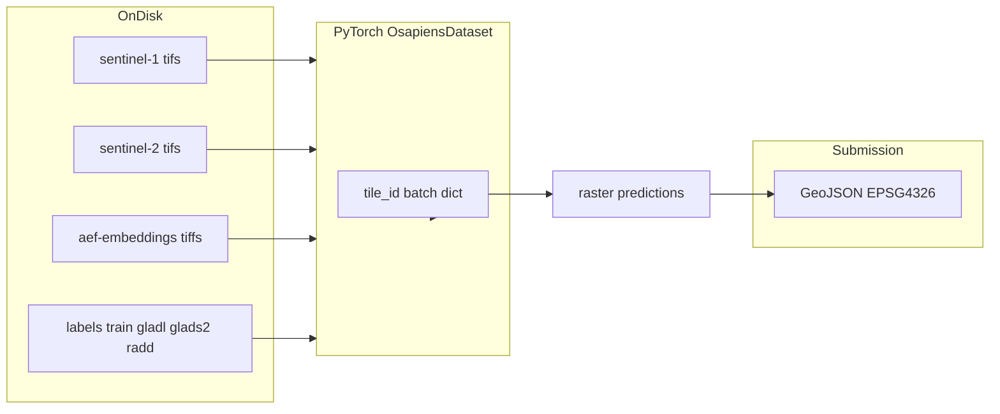

# Step-by-step: understand and explain the data in this project

## What you are actually learning

“Data structure” here means **three connected views**—you will want all three in your head:

| View                  | Where it lives                                                                                  | Your question                                                                              |
| --------------------- | ----------------------------------------------------------------------------------------------- | ------------------------------------------------------------------------------------------ |
| **On disk**           | [`data/makeathon-challenge/`](c:\Users\balth\Documents\project\makeathon\data) (after download) | What folders and files exist, and how are they named?                                      |
| **In code / tensors** | [`src/dataset.py`](c:\Users\balth\Documents\project\makeathon\src\dataset.py) `OsapiensDataset` | What does each training sample contain (`s2`, `s1`, `aef`, `label`), and what shape/dtype? |
| **Submission**        | [`submission_utils.py`](c:\Users\balth\Documents\project\makeathon\submission_utils.py)         | How do predictions leave the model world and become leaderboard GeoJSON?                   |

This repo already documents the on-disk layout in [README.md](c:\Users\balth\Documents\project\makeathon\README.md) (see **Dataset Layout**). The notebook [`challenge.ipynb`](c:\Users\balth\Documents\project\makeathon\challenge.ipynb) is the guided tour; `OsapiensDataset` is the implementation truth for training.

---

## Step 1 — Read the story before the code (30–60 min)

Work through these **in order** (also recommended in the README):

1. **[`osapiens-challenge-full-description.md`](c:\Users\balth\Documents\project\makeathon\osapiens-challenge-full-description.md)** — problem framing: what each modality is _for_ and what noise/weak labels mean in plain language.
2. **README “Dataset Layout”** — memorize the folder tree: `sentinel-1`, `sentinel-2`, `aef-embeddings`, `labels/train` (three sources), `metadata` GeoJSONs.

**Deliverable for yourself:** one short paragraph answering: _What is one tile, and what modalities must align to it?_

---

## Step 2 — See the real folder tree (15 min)

After you have data locally (or even if not yet), open `data/makeathon-challenge/` in your file explorer or terminal and **list one `tile_id`** worth of paths:

- Under `sentinel-2/train/`, note folders named like `{tile_id}__s2_l2a/`.
- Mirror the same `tile_id` under `sentinel-1/...__s1_rtc/` and `aef-embeddings/train/`.
- For **train only**, look at `labels/train/{gladl,glads2,radd}/` for files matching that tile.

**Why:** Naming conventions tie every modality to a single geographic patch (`tile_id`). That is the backbone of the whole design.

---

## Step 3 — Work through `challenge.ipynb` actively (1–2 hours)

Do not skim: **run cells** and change nothing at first—just observe outputs (plots, shapes, CRS notes). The notebook walks through Sentinel-2 RGB, Sentinel-1 backscatter, AEF alignment, and label reprojection—matching comments you can grep in the notebook (e.g. “Reproject … onto the … grid”).

While you go, jot down:

- **Spatial grid:** which raster is the “reference” (in this project, Sentinel-2 drives height/width; see padding notes in `OsapiensDataset.__getitem__`).
- **Temporal:** time series length (`seq_len`, default 12) and how multiple `.tif` files per tile become a stack.
- **Labels:** three weak sources averaged into a consensus (see [`src/dataset.py`](c:\Users\balth\Documents\project\makeathon\src\dataset.py) around the `gladl` / `glads2` / `radd` loop).

**Deliverable:** a mini table _you_ write (on paper or in notes): modality → file pattern → what the notebook says it represents.

---

## Step 4 — Read `OsapiensDataset` like a data contract (45 min)

Open [`src/dataset.py`](c:\Users\balth\Documents\project\makeathon\src\dataset.py) and read in this order:

1. **How `self.tiles` is built** (from Sentinel-2 folder names).
2. **`__getitem__`:** for one index, trace: load S2 time series → S1 → AEF (optional) → labels (train only) → align/pad to S2 → optional flips → return dict with keys `"tile_id"`, `"s2"`, `"s1"`, `"aef"`, `"label"`.

**Deliverable:** for each dict key, write: _tensor shape idea_ (e.g. channels × time × H × W where applicable) and _what empty tensor means_ (`torch.empty(0)` when modality missing).

Skim [`src/train.py`](c:\Users\balth\Documents\project\makeathon\src\train.py) only for **auto-detected channel counts** from the first batch (`s1_dim`, `s2_dim`, `aef_dim`)—that connects files to `FusionNet` inputs.

---

## Step 5 — Trace “prediction → submission” (20 min)

Read the docstring at the top of [`submission_utils.py`](c:\Users\balth\Documents\project\makeathon\submission_utils.py): binary GeoTIFF → polygons → GeoJSON in EPSG:4326, with a minimum area filter.

**Deliverable:** three bullets: _what the model should output before this step_ (binarised raster), _what file format_, _what CRS the leaderboard expects_.

---

## Step 6 — Practice explaining (the part with no experience)

Use the **Feynman method**: explain aloud as if to someone who knows programming but not Earth observation.

1. **2-minute version:** Start at the tile: “One training example is one geographic tile indexed by `tile_id`; we stack Sentinel-2 over time, add Sentinel-1 and optional AEF embeddings aligned to the same grid; train labels are a consensus of three weak raster sources; the model returns …; submission converts a binary mask to GeoJSON.”
2. **Draw** the mermaid-style flow above from memory (disk → dataset dict → model → GeoJSON). Gaps show what to re-read.
3. **Anticipate one question:** e.g. _Why three label folders?_ (weak supervision / different sensors), or _Why pad to S2?_ (fusion requires identical H×W).

Optional deeper reads if something is still fuzzy: [`src/fusion_net.py`](c:\Users\balth\Documents\project\makeathon\src\models\fusion_net.py) (how modalities enter the network), [`src/label_consensus.py`](c:\Users\balth\Documents\project\makeathon\src\label_consensus.py) if you need alternate consensus logic.

---

## Checklist: you are ready when you can answer these without notes

- What uniquely identifies one geographic sample?
- Name the three label subfolders and what the code does with them (high level).
- What are the four keys in each `OsapiensDataset` sample, and which is reference for spatial size?
- What does the submission pipeline expect as input file type and value semantics (0/1)?

No code changes are required for this learning path; it is entirely reading, running the notebook, and note-taking.
